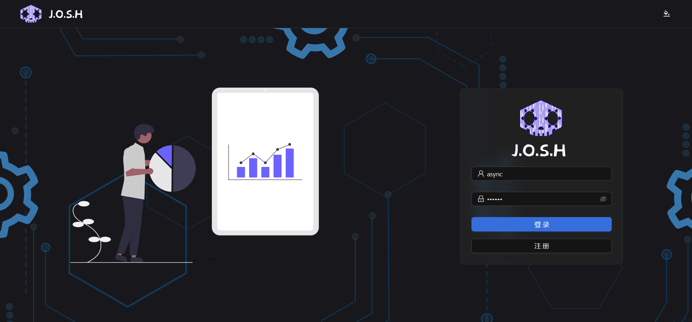
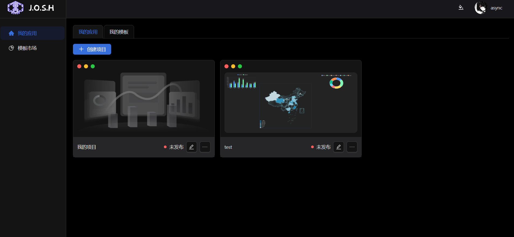
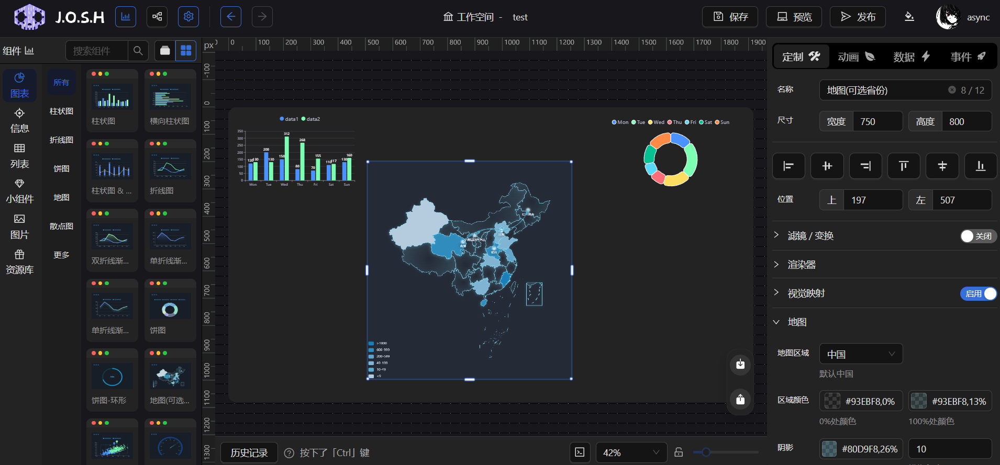
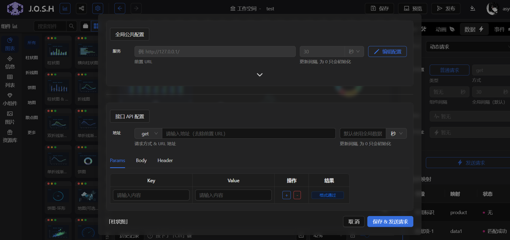
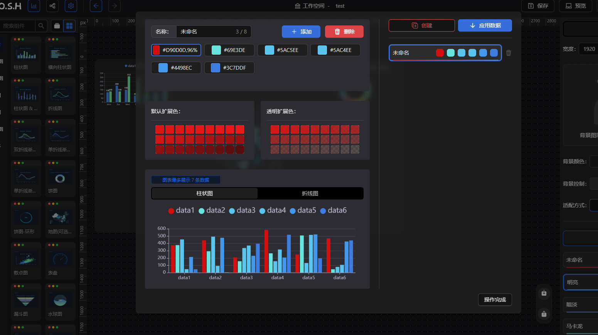
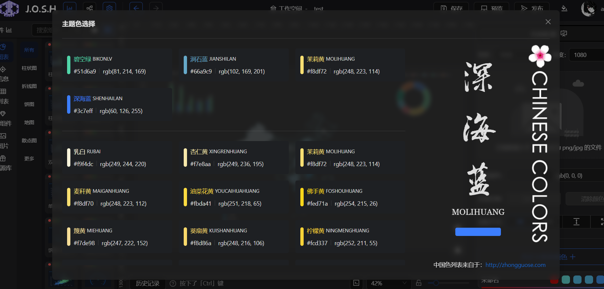

# J.O.S.H— 一个数据可视化低代码平台（毕业设计）

## 项目介绍

在线访问：https://josh.fasyncsy.com.cn

参考实现：[GoView 说明文档 | 低代码数据可视化开发平台 (mtruning.club)](https://www.mtruning.club/#/)

**该项目属于 GoView 的 React Demo 版本，大部分功能（未全部实现）和实现方案都来自于 GoView**，因此只为有 GoView 项目的基本需求但技术栈受限的开发者（React 技术栈）学习参考，仅限学习！！！

如果有数据可视化大屏的业务需求可以了解： [GoView Pro | 低代码数据可视化平台官网](https://ai.goviewlink.com/saas/)

**纯前端分支**：`main`（在线访问版本）

**前后端分支**：`fetch` （搭配 Nest 后端实现基本接口）

使用技术：

-   框架部分：React18 + React-Router + zustand + TS

-   组件库：Antd5

-   图表库：Echarts5、echarts-for-react
-   周边工具：axios 请求库、lodesh-es 工具库、react-ruler 编辑器标尺、codemirror 代码编辑器、animate.css 动画库等等...

## 未实现功能

GoView 的大部分功能均已实现，但由于**该项目属于作者本人的毕业设计，为了应付前中期的系统验收所以部分功能需求优先级较低**，一直到现在毕业即将就业也没有完成，后续可能没有更多的时间去维护了，所以在这里仅列出**与 GoView 相比未实现的功能**（可能不全）：

-   主题切换功能移除（light 主题太丑）
-   国际化功能移除
-   图表拖拽未实现辅助线吸附功能
-   编辑器内未实现框选图表功能
-   图表组织没有实现分组功能
-   图表数据配置未实现公共接口功能
-   图表事件配置虽然实现，但效果未知，没有测试事件联动图表效果，需自行摸索
-   部分编辑器快捷键未实现，Mac 未兼容（只实现了 CTRL + C、CTRL + V、 DELETE 删除、CTRL + S 保存、CTRL + 滚轮缩放）

## 系统部分截图

系统封面：

用户界面：

编辑器界面：

图表数据接口配置：

图表主题配置：

系统主题配置：

